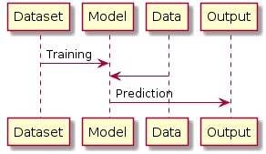
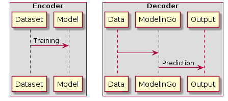
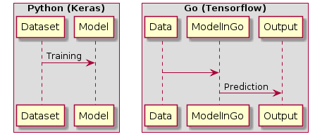

## Train with Python. <br> Predict with Go.  
##### <span style="font-family:Helvetica Neue; font-weight:bold"><span style="color:#e49436">Making the most of the best of both worlds</span></span>

---

## <span style="font-family:Rockitt; font-weight:bold"> Why is Python good?</span>

  - Pseudo code like syntax 
  - Doesn't need too much parallelism | 
  - Libraries |
  - Community |

---

## <span style="font-family:Rockitt; font-weight:bold">Twin Discplines</span>



+++



--- 

## <span style="font-family:Rockitt; font-weight:bold">Divide and Conquer</span>

<br>
<span class="fragment" data-fragment-index="1" style="font-family:Hattori Hanzo;">Train with Python</span> 
<br>
<span class="fragment" data-fragment-index="1" style="font-family:Hattori Hanzo;">Predict with Go</span> 
<br>

+++




---


---

## <span style="font-family:Rockitt; font-weight:bold">Why Go is good?</span>


 - Light weight 
 - Compiled Binary makes deployment easy | 
 - Better performance | 
 - Easy Concurrency has more applications on the predictor side |

---

## <span style="font-family:Rockitt; font-weight:bold">Request handling Benchmarks</span>

+++
<span class="fragment" data-fragment-index="1" style="font-family:Hattori Hanzo;">Python + Flask</span> 
</br>
<span class="fragment" data-fragment-index="1" style="font-family:Hattori Hanzo;">16393 requests in 30s</span>
+++
<span class="fragment" data-fragment-index="1" style="font-family:Hattori Hanzo;">Python + Twisted</span> 
</br>
<span class="fragment" data-fragment-index="1" style="font-family:Hattori Hanzo;">102781 requests in 30s</span>
+++
<span class="fragment" data-fragment-index="1" style="font-family:Hattori Hanzo;">PyPy2.7 Python + Twisted</span> 
</br>
<span class="fragment" data-fragment-index="1" style="font-family:Hattori Hanzo;">379001 requests in 30s</span>
+++
<span class="fragment" data-fragment-index="1" style="font-family:Hattori Hanzo;">Node + Express</span> 
</br>
<span class="fragment" data-fragment-index="1" style="font-family:Hattori Hanzo;">268866 requests in 30s</span>
+++
<span class="fragment" data-fragment-index="1" style="font-family:Hattori Hanzo;">Go + Chi</span> 
</br>
<span class="fragment" data-fragment-index="1" style="font-family:Hattori Hanzo;">1550508 requests in 30s</span>

+++
@title[Request handling benchmarks]

<canvas class="stretch" data-chart="horizontalBar">
<!--
{
 "data" : {
  "labels" : ["Python + Flask", "Python + Twisted", "PyPy2.7 Python + Twisted",
    "Node + Express", "Go + Chi"],
  "datasets" : [{
    "data": [16393, 102781, 379001, 268866, 1550508],
    "backgroundColor": "#e49436",
    "borderColor": "#e49436"
  }]
  },
  "options": {
    "title": {
      "display": true,
      "text": "Request handling benchmarks",
      "fontColor": "gray",
      "fontSize": 20
    },
    "legend": {
      "display": false
    },
    "scales": {
      "xAxes": [{
        "ticks": {
            "beginAtZero": true,
            "max": 1600000,
            "stepSize": 10000,
            "fontColor": "gray"
        },
        "scaleLabel": {
          "display": true,
          "labelString": "Requests in 30s",
          "fontColor": "gray"
        }
      }],
      "yAxes": [{
        "ticks": {
            "fontColor": "gray"
        }
      }]
    }
  }
}
-->
</canvas>

---

## <span style="font-family:Rockitt; font-weight:bold">Proof of Concept</span>

+++

[](https://asciinema.org/a/kVDQ7RhcMYnNrKblwjYldgUCe?autoplay=1)

+++

---

## <span style="font-family:Rockitt; font-weight:bold">Some useful points</span>

 - Keras is a great library for beginners |
 - Tensorflow has bindings for Go and Python |
 - Tensorflow graphs are language agnostic |

---


## <span style="font-family:Rockitt; font-weight:bold">Training</span>

+++


#### <span style="font-family:Rockitt; font-weight:bold">Tensorflow for Go has three pre-requisites to read a model/graph</span>

 - Tag Name |
 - Input Layer name | 
 - Inference Layer name |

+++

<span class="fragment" data-fragment-index="1" style="font-family:Hattori Hanzo;">Setting the Tensorflow session to Keras enables us to use a tag when saving the graph</span> 

```python
    import tensorflow as tf
    from keras import backend as K
    sess = tf.Session()
    K.set_session(sess)
```
+++

<span class="fragment" data-fragment-index="1" style="font-family:Hattori Hanzo;">My model is a finetune of pretrained ResNet50 weights. The input layer is `input_1`</span> 
    
+++

<span class="fragment" data-fragment-index="1" style="font-family:Hattori Hanzo;">Name the inference layer</span> 
```python
    x = Dense(len(classes), activation="softmax", name="inferenceLayer")(last)
```

+++


<span class="fragment" data-fragment-index="1" style="font-family:Hattori Hanzo;">After training, save the model with a tag</span> 

```python
    builder = tf.saved_model.builder.SavedModelBuilder("forGo")
    builder.add_meta_graph_and_variables(sess, ["tags"])
    builder.save()
    sess.close()
```

+++

---

## <span style="font-family:Rockitt; font-weight:bold">Prediction</span>

+++

+++?code=src/main.go&lang=golang&title=Source: Golang Code
@[1, 3-6]
@[16-16](Load the saved graph like so)
@[32-40](The following code runs the decoder for the saved model)


+++

---

## <span style="font-family:Rockitt; font-weight:bold">Plugs</span>

<br>
<span class="fragment" data-fragment-index="1" style="font-family:Hattori Hanzo;">Blog: https://sudarshan-reddy.github.io/post/keras-to-go/ </span>
<br>
<span class="fragment" data-fragment-index="1" style="font-family:Hattori Hanzo;">Training Code: https://github.com/sudarshan-reddy/resnetClassifier</span>
<br>
<span class="fragment" data-fragment-index="1" style="font-family:Hattori Hanzo;">Prediction Code: https://github.com/sudarshan-reddy/resnetPredictor</span>
<br>
<span class="fragment" data-fragment-index="1" style="font-family:Hattori Hanzo;">Library for Go: https://github.com/sudarshan-reddy/telemus
</span>
<br>

---

<span style="font-family:Rockitt; font-weight:bold">That's it. Really!</span>

---
